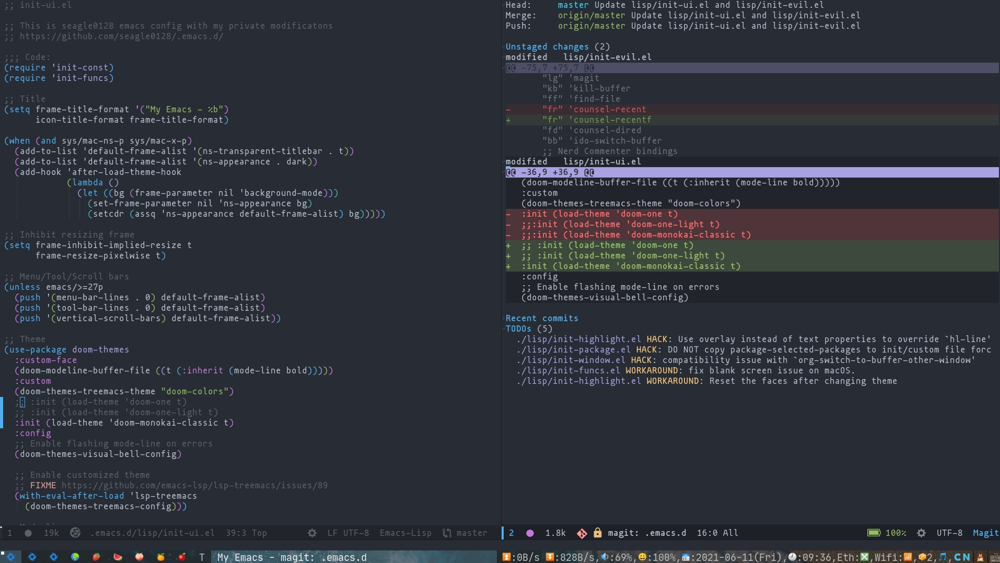
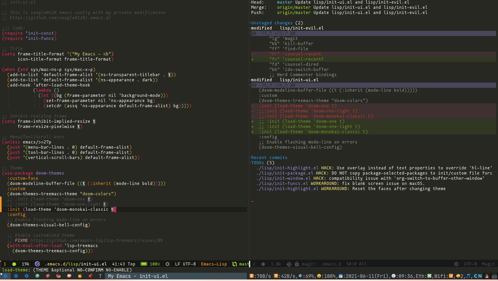

<!-- TOC GFM -->

- [介绍](#介绍)
- [快速开始](#快速开始)

<!-- /TOC -->

### 介绍
这是我的Emacs配置,它`fock`于`@seagle0128`,[Github](https://github.com/seagle0128/.emacs.d)<br/>
它只是去掉了很多对于我来说没什么用的软件包,和一些很小的更改以适应我的需求




### 快速开始
```bash
mv ~/.emacs.d ~/.emacs.d.bak
git clone --depth 1 https://github.com/Wjinlei/.emacs.d.git ~/.emacs.d
```
